# Importación de CSV en AuraDB con Cypher 🚀

- [📌 Conceptos Clave](#-conceptos-clave)  
  - [CSV (Comma-Separated Values)](#csv-comma-separated-values)  
  - [TSV (Tab-Separated Values)](#tsv-tab-separated-values)  
  - [UTF-8 (Formato de Datos)](#utf-8-formato-de-datos)
  - [Raw (Versión sin procesar)](#raw-versión-sin-procesar)
  - [Transacción en Neo4j](#transacción-en-neo4j)
- [📂 Archivos Importantes](#-archivos-importantes)  
- [🛠️ Pasos para la Importación](#️-pasos-para-la-importación)  
  - [1. Comprender la Estructura de los Datos](#1-comprender-la-estructura-de-los-datos)  
  - [2. Diseñar el Modelo de Datos](#2-diseñar-el-modelo-de-datos)  
  - [3. Preparar los Datos para la Importación](#3-preparar-los-datos-para-la-importación)  
  - [4. Importar los Datos con Data Importer](#4-importar-los-datos-con-data-importer)  
  - [5. Importar los Datos Usando Cypher](#5-importar-los-datos-usando-cypher)  
- [🔗 Enlaces Útiles](#-enlaces-útiles)
  - [Enlaces de Herramientas Utilizadas](#enlaces-de-herramientas-utilizadas)
  - [Enlaces de Documentación](#enlaces-de-documentación)

## 📌 Conceptos Clave

### CSV (Comma-Separated Values)

Es un formato de archivo de texto en el que los datos están separados por comas. Se utiliza comúnmente para almacenar datos tabulares de manera sencilla y compatible con muchas aplicaciones.

**Ejemplo:**

```csv
Nombre,Edad,País
Juan,25,México
Ana,30,España
```

### TSV (Tab-Separated Values)

Similar al CSV, pero los valores están separados por tabulaciones en lugar de comas. Es útil cuando los datos contienen comas, evitando confusiones en la separación.

**Ejemplo:**

```tsv
Nombre	Edad	País
Juan	25	México
Ana	30	España
```

### UTF-8 (Formato de Datos)

Es una codificación de caracteres ampliamente utilizada que puede representar casi todos los caracteres del mundo. Es compatible con ASCII y es el estándar en la web y muchos sistemas.

**Ejemplo de caracteres en UTF-8:**

- `A` (Letra en ASCII y UTF-8)
- `ñ` (Carácter especial en español)
- `✓` (Símbolo de verificación)

### Raw (Versión sin procesar)

En GitHub, cuando se hace clic en el enlace "Raw" de un archivo, se obtiene el contenido del archivo sin ningún formato o presentación adicional. Es una versión del archivo tal como está, útil para descargarlo o usarlo directamente en su formato original.

**Ejemplo de URL raw:**

```markdown
https://raw.githubusercontent.com/JosueSay/Neo4j_Documentation/refs/heads/main/csv_import/data/ventas_tienda_departamento_formated.csv
```

### Transacción en Neo4j

Son unidades de ejecución que agrupan varias operaciones para asegurar que se ejecuten de forma segura y consistente. Si ocurre un error, toda la transacción se revierte.

**Ejemplo de transacciones:**

```sql
LOAD CSV WITH HEADERS FROM 'file:///datos.csv' AS row
CALL { WITH row
  MERGE (n:Etiqueta {nombre: row.nombre})
} IN TRANSACTIONS OF 100 ROWS;
```

## 📂 Archivos Importantes

```bash
├── images/                    # Imágenes de apoyo
├── data/                      # Carpeta donde están los dataset de tipo `.csv`
├── detalle_load_csv.md        # Archivo md que detalla más a profundidad la función LOAD CSV de cypher neo4j
├── code.cql                   # Archivos con los querys para Neo4j para la importación
├── cambiar_delimitador.py     # Scripts en python para cambiar el delimitador de un archivo `.csv`
├── cambiar_formato.py         # Scripts en python para cambiar el formato de un archivo `.csv`
└── requirements.txt           # Dependencias necesarias para los scripts
```

## 🛠️ Pasos para la Importación

Para esta documentación se utilizará el dataset `ventas_tienda_departamento_formated.csv` de la carpeta `data`.

### 1. Comprender la Estructura de los Datos

Analizar los datos de origen para identificar sus características, relaciones y posibles inconsistencias. En el csv de ejemplo, se puede observar:

1. **Tienda**: *(String)* – Nombre de la ubicación donde se realiza la venta (por ejemplo, "Lima").
2. **Marca**: *(String)* – Marca del producto (por ejemplo, "Asics", "Nike").
3. **Tipo**: *(String)* – Modelo o tipo específico del producto (por ejemplo, "WB1820", "Cummulus 17").
4. **Género**: *(String)* – Público objetivo del producto (por ejemplo, "Femenino", "Masculino", "Usinex" que podría interpretarse como "Unisex").
5. **Talla**: *(String)* – Talla o rango de tallas (por ejemplo, "42", "42-44", "38-40").
6. **Color**: *(String)* – Color del producto (por ejemplo, "Azul", "Negro", "Multicolor").
7. **Categoría**: *(String)* – Categoría del producto (por ejemplo, "Pantalon", "Zapatillas", "Ropa interior").
8. **Precio de venta S/**: *(Float)* – Precio de venta en soles (por ejemplo, 89.0, 159.0).
9. **Fecha**: *(String)* – Fecha de la transacción en formato DD/MM/AAAA (por ejemplo, 15/07/2015).
10. **Hora**: *(String)* – Hora de la transacción en formato HH:MM:SS (por ejemplo, 07:32:00).

**Observaciones:**

- **Tipos de datos**: Se observan datos textuales, numéricos y de fecha/hora.
- **Inconsistencias y Mejoras**:
  - La columna "Género" tiene "Usinex", que parece un error tipográfico para "Unisex".
  - La "Talla" puede ser un solo valor o un rango, lo que podría requerir limpieza o estandarización.
  - La "Marca" y "Tipo" están bien definidas pero podrían contener inconsistencias si el dataset completo es grande (diferencias de mayúsculas, errores tipográficos, etc.).
  - El "Color" tiene valores como "Multicolor", lo que podría ser un desafío para categorizar.
  - Se puede unir en una columna extra las columnas "Fecha" y "Hora" ya que neo4j maneja un tipo de date `datetime` unidos, para este ejemplo se utilizaran como strings.
- **Entidades identificables**: Tienda, Marca, Producto, Categoría, Venta (transacción).

### 2. Diseñar el Modelo de Datos

Definir cómo se representarán los datos en el grafo, incluyendo nodos, relaciones y propiedades. En el csv de ejemplo, se puede obtener:

#### **Nodos principales**

1. **Tienda**:
   - *Propiedades*: `nombre`

2. **Marca**:
   - *Propiedades*: `nombre`

3. **Producto**:
   - *Propiedades*: `tipo`, `genero`, `talla`, `color`, `categoria`, `precio`

4. **Venta**:
   - *Propiedades*: `fecha`, `hora`

#### **Relaciones**

- `(Tienda)-[:VENDE]->(Producto)`
- `(Marca)-[:FABRICA]->(Producto)`
- `(Venta)-[:INCLUYE]->(Producto)`
- `(Tienda)-[:REALIZA]->(Venta)`

Para ver el modelo se puede utilizar el `Arrows App` el enlace está en la sección de [Enlaces de Herramientas Utilizadas](#enlaces-de-herramientas-utilizadas)

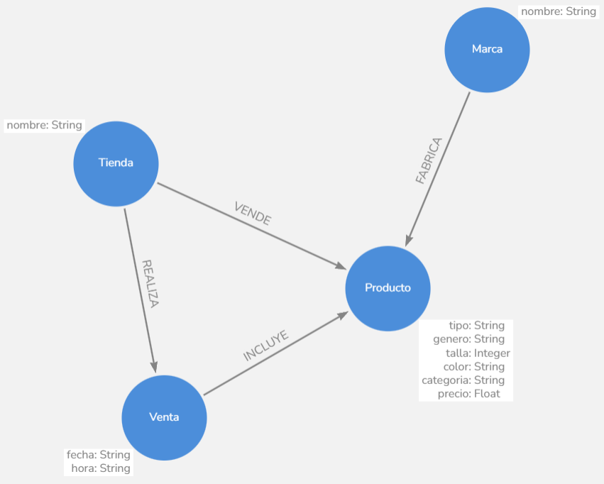

### 3. Preparar los Datos para la Importación

Para asegurar una importación correcta en Neo4j, es necesario estandarizar el **formato de codificación** y el **delimitador de columnas** en los archivos CSV.  

- Se recomienda utilizar **UTF-8** para evitar problemas de codificación.  
- El delimitador debe ser **coma ( , )** para garantizar compatibilidad con Neo4j.  

#### **Sin Código**

En Windows, el delimitador predeterminado para CSV puede variar según la configuración regional del sistema. Para ajustarlo:  

1. **Abrir el Panel de Control** y buscar "Configuración regional" o "Formato de fecha y hora".  

   

   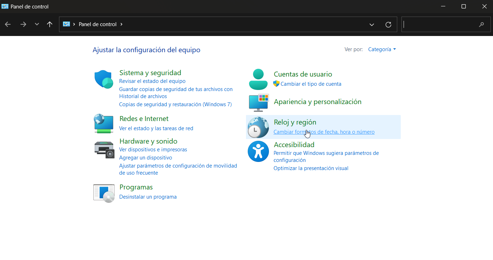

2. Ir a **Configuración adicional** y modificar el campo **"Separador de listas"**, cambiándolo por una coma (`,`) si es necesario.

   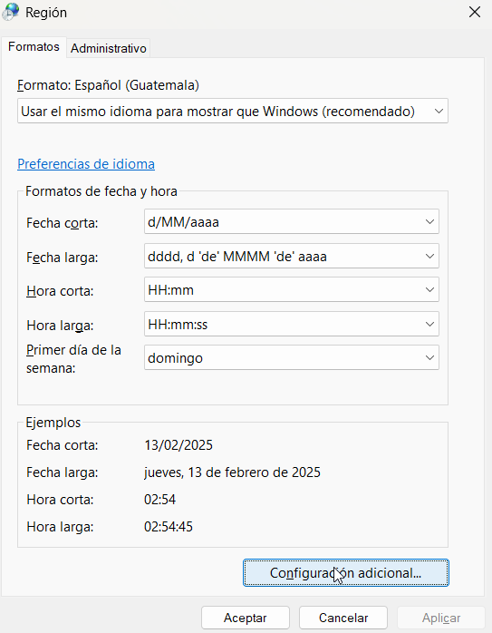

   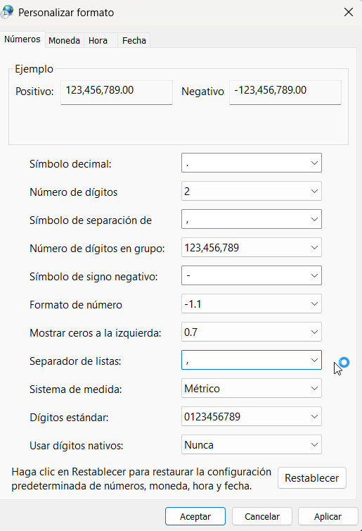

3. Guardar los cambios y aplicar.  

4. **Abrir Excel** y dirigirse a `Datos > Obtener y Transformar Datos > De texto/CSV`.  

   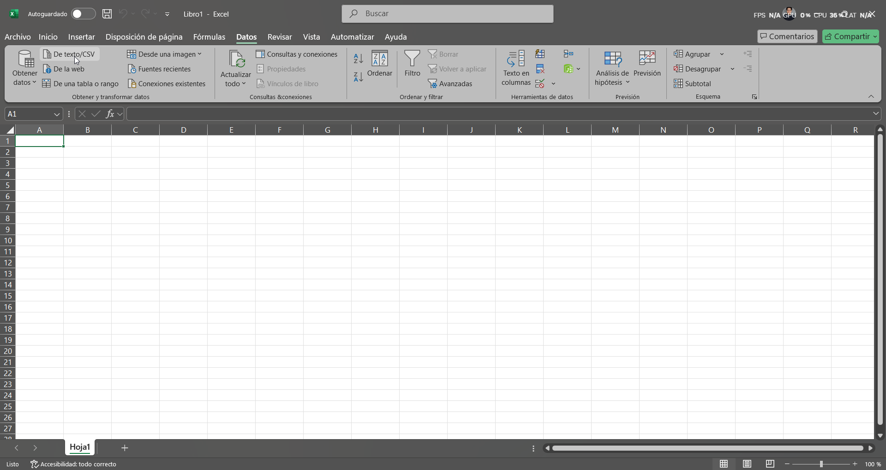

5. Seleccionar el archivo CSV a importar. Si el delimitador no es correcto, cambiarlo en la vista previa antes de cargar los datos.  

   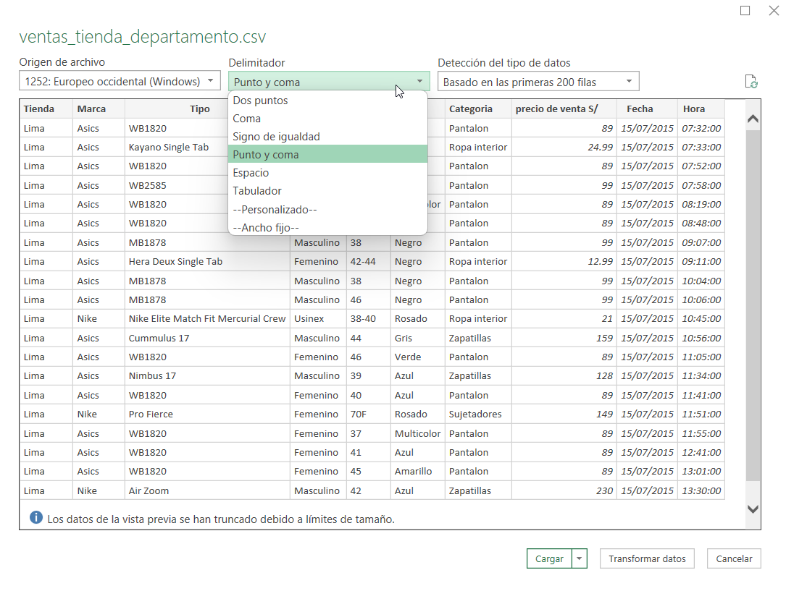

6. Una vez cargado, ir a `Archivo > Guardar como`, seleccionar **"CSV delimitado por comas"** o **"CSV UTF-8 delimitado por comas"**, según sea necesario.
   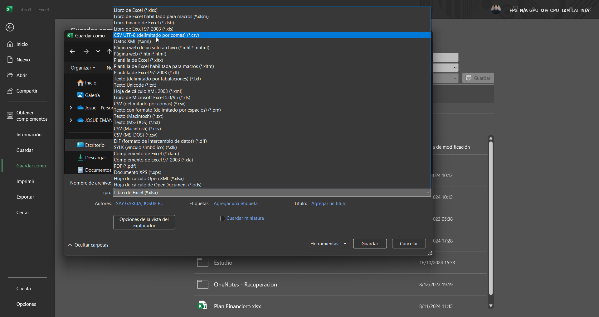

7. Abrir el archivo CSV en **Bloc de notas**.

   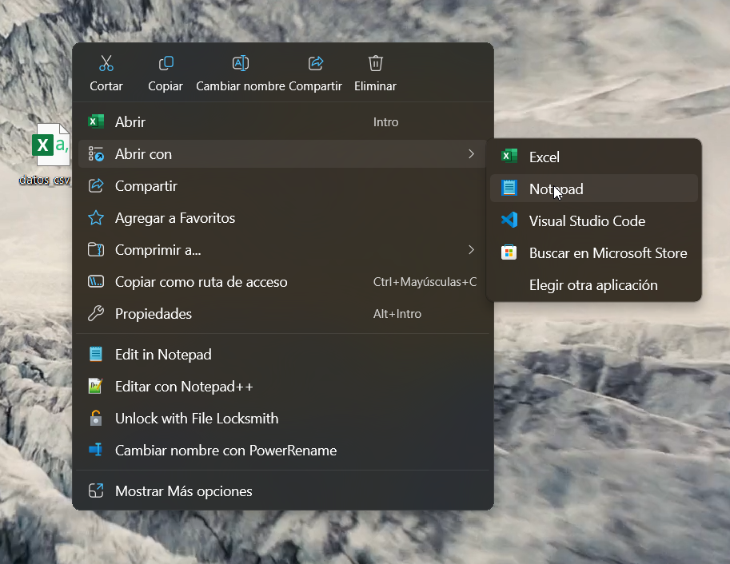

   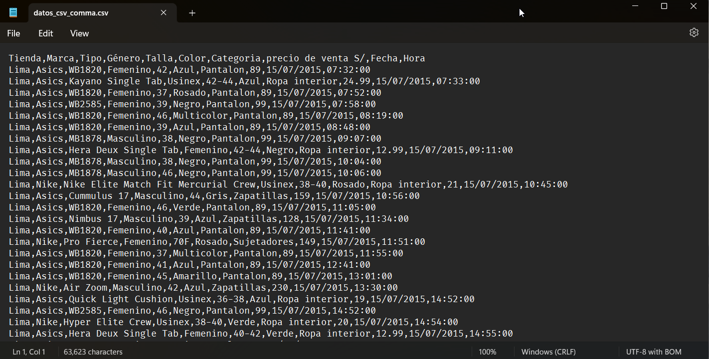

8. Ir a `Archivo > Guardar como`, y en la opción **"Codificación"**, seleccionar **UTF-8** antes de guardar.

   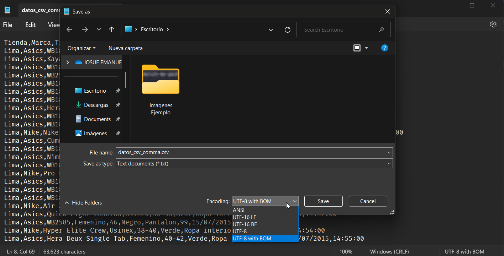

#### **Con código**

Para realizar estos cambios de forma más rápida y automatizada, puedes usar los scripts auxiliares en Python de la carpeta `csv_import`.

- Tener **Python 3.12** instalado.
- Instalar dependencias con:

  ```bash
  pip install -r requirements.txt
  ```

- Ubicar los scripts:
  - `cambiar_delimitador.py`: Cambia el delimitador de los archivos CSV.  
  - `cambiar_formato.py`: Convierte el formato de codificación a UTF-8 o cualquier otro formato deseado.  

- Para usar los scripts puedes abrir directamente el codigo y cambiar el contenido de las variables al final del scripts por los propios; para ver el significado de los parámetros que necesita puedes ver la documentación de cada script. Luego ejecutas el programa y obtendras los archivos convertidos.

> **Nota:** En la carpeta `data`, encontrarás archivos de ejemplo ya convertidos con estos scripts.

### 4. Importar los Datos con Data Importer

Para comenzar, debemos crear una instancia en Neo4j. Esto se realiza accediendo al enlace de `Neo4j Console`, que se encuentra en la sección de [Enlaces de Herramientas Utilizadas](#enlaces-de-herramientas-utilizadas). Una vez creada la instancia, se nos ofrecerá la opción de guardar las credenciales, las cuales debemos descargar, ya que contienen los datos necesarios para establecer la conexión con Data Importer:

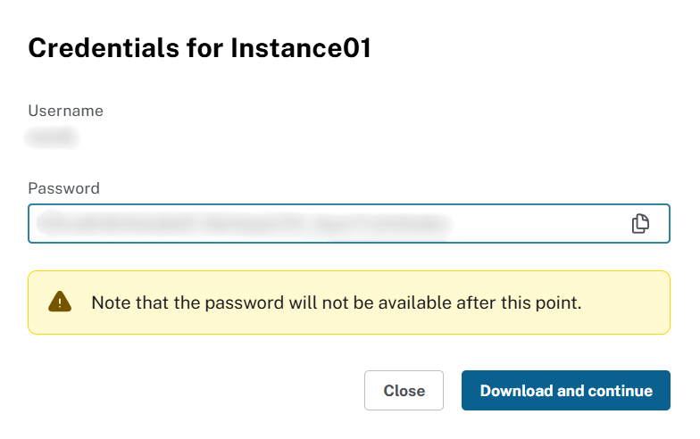

Al abrir el archivo descargado, encontraremos los siguientes datos:

```bash
NEO4J_URI=neo4j+s://url
NEO4J_USERNAME=username
NEO4J_PASSWORD=password
AURA_INSTANCEID=instance_id
AURA_INSTANCENAME=instance_name
```

En la sección de [Enlaces de Herramientas Utilizadas](#enlaces-de-herramientas-utilizadas) encontrarás un enlace para acceder a `Data Importer Neo4j`. Una vez dentro, se nos pedirá conectar la instancia proporcionando los datos necesarios.

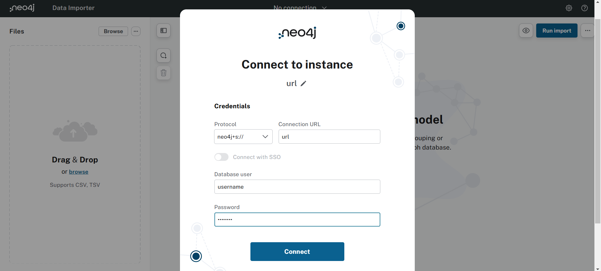

Una vez conectados, podremos cargar los archivos CSV, ya sea arrastrándolos o seleccionándolos manualmente.


#### Crear Nodos

Una vez cargado el CSV, podremos crear nodos:

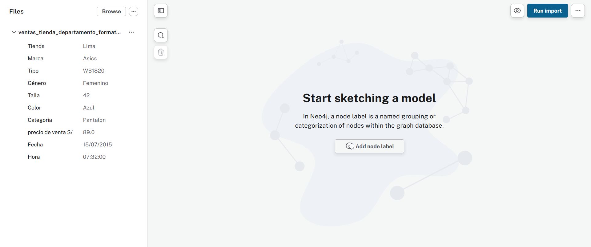

Para crear un nodo, debemos proporcionar los siguientes datos:

1. **Label**: Nombre del nodo.
2. **File**: Selección del archivo CSV que contiene los datos correspondientes al nodo (es posible cargar varios archivos CSV, no solo uno).
3. **Properties**: Aquí podemos añadir propiedades al nodo haciendo clic en el botón "+" y configurando el nombre de la propiedad, el tipo de dato y la columna que contiene los datos. También existe la opción "Map From File", que permite importar varias columnas de datos directamente.

Al completar los datos, la interfaz mostrará un check verde sobre el nodo, indicando que los datos se ingresaron correctamente:

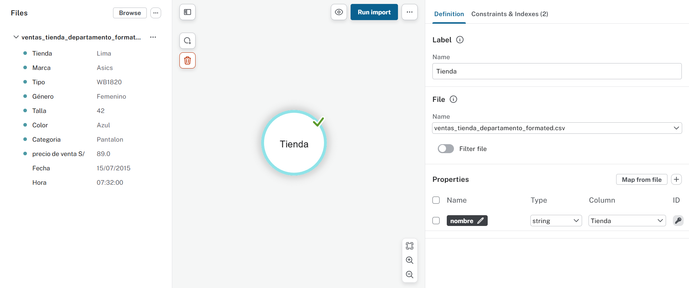

#### Agregar Más Nodos

Si necesitamos agregar más nodos, podemos utilizar la segunda opción en la interfaz:

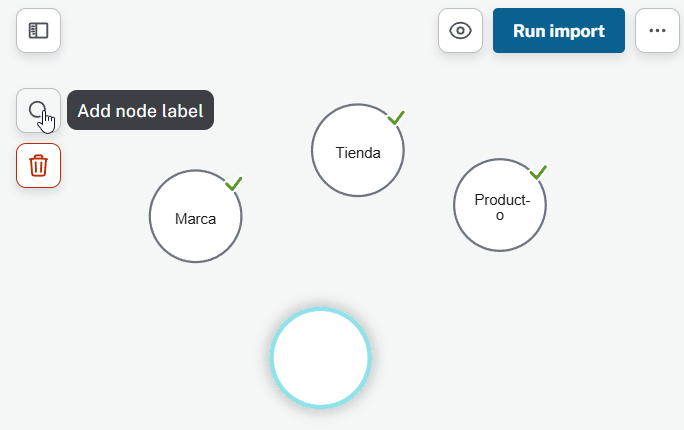

#### Crear Relaciones

Para establecer relaciones entre nodos, simplemente arrastramos el borde de un nodo hacia otro y completamos los campos (en este caso, solo el nombre de la relación).

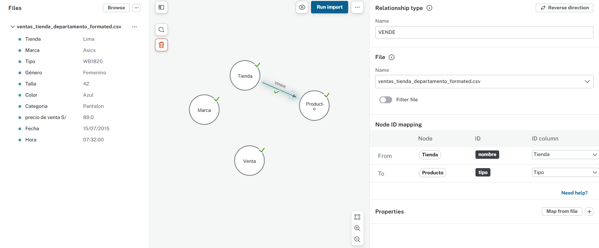

Al igual que con los nodos, las relaciones se marcarán con un check verde cuando los datos se ingresen correctamente.

#### Modelo Completo en Data Importer

El modelo final en Data Importer se verá de la siguiente manera:

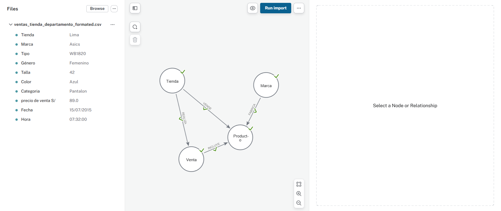

#### Ejecutar la Importación

Para finalizar, presionamos la opción `Run Import`. Al completar la importación, aparecerá una ventana con los resultados y las consultas realizadas:

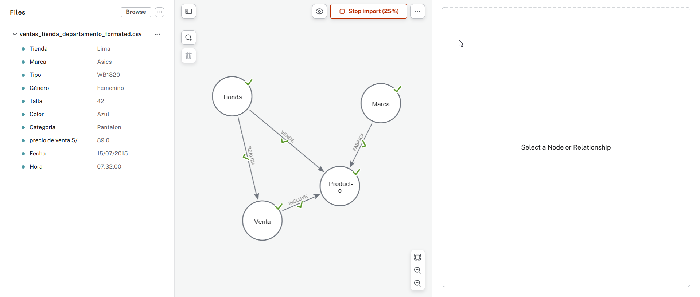

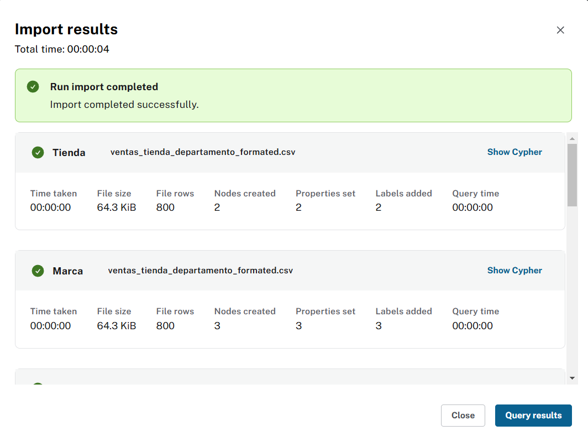

#### Verificar Resultados en Neo4j

Podemos verificar los resultados de la importación mediante el navegador de Neo4j. En la sección de [Enlaces de Herramientas Utilizadas](#enlaces-de-herramientas-utilizadas) se encuentra un enlace para acceder a `Neo4j Browser`. Ingresamos los mismos datos de conexión de nuestra instancia.

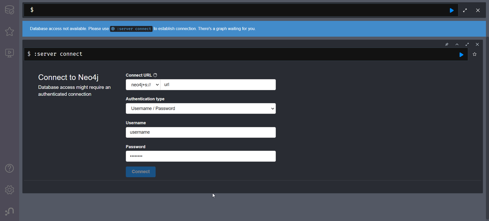

Alternativamente, podemos ir directamente a `Neo4j Console`, ir a la sección de consultas (query) y ejecutar el siguiente comando:

```sql
MATCH (n)-[r]->(m) 
RETURN n, r, m;
```

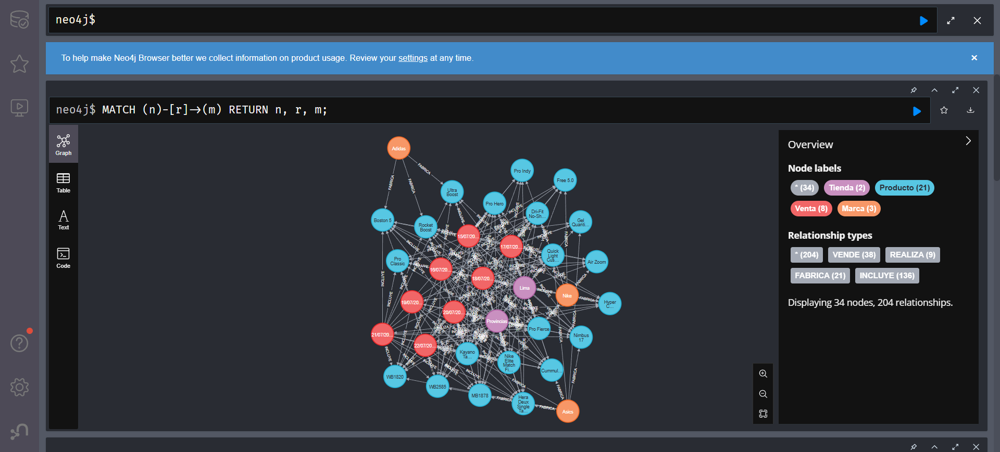

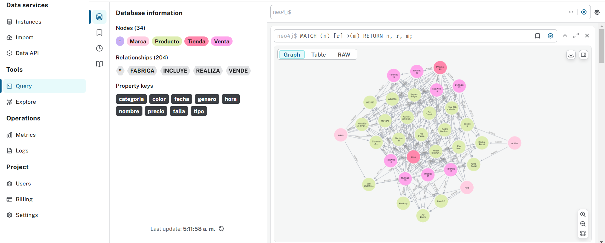

### 5. Importar los Datos Usando Cypher

Utilizando la misma instancia creada en el paso 4, primero eliminaremos todos los datos para realizar la importación desde Cypher:

```sql
MATCH (n)
DETACH DELETE n;
DROP CONSTRAINT `fecha_Venta_uniq`;
DROP CONSTRAINT `nombre_Marca_uniq`;
DROP CONSTRAINT `nombre_Tienda_uniq`;
DROP CONSTRAINT `tipo_Producto_uniq`;
```

#### Métodos de Importación

Existen dos métodos principales para importar datos en Neo4j:

1. **`LOAD CSV`**: Este comando es ideal para conjuntos de datos pequeños o medianos (hasta 10 millones de registros). Funciona en cualquier configuración, incluyendo **AuraDB**.
2. **`neo4j-admin database import`**: Es una herramienta de línea de comandos para la carga de grandes volúmenes de datos. Se usa en **Neo4j Desktop**, **Neo4j EE Docker** e instalaciones locales.

En este caso, usaremos **AuraDB** y necesitaremos un método para acceder a los datos del CSV.

##### Subir el CSV a un Repositorio en GitHub

1. Subimos el archivo CSV a un repositorio de GitHub.
2. Vamos al archivo en GitHub y presionamos la opción **RAW** para obtener el enlace al archivo en formato crudo:

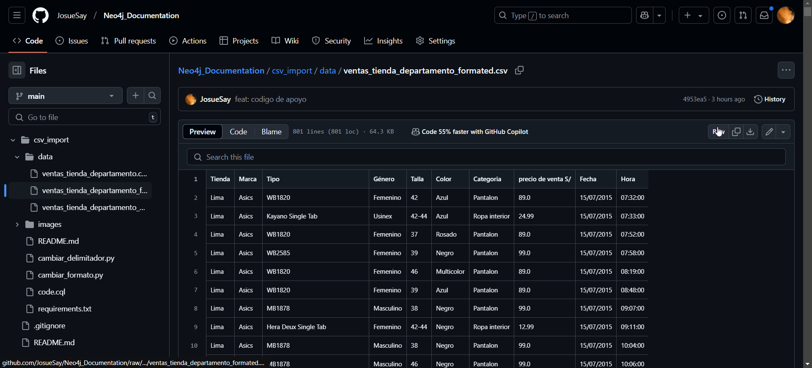

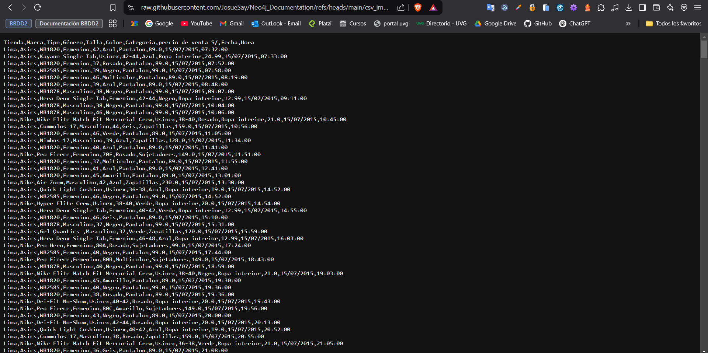

Ejemplo de enlace generado:

```markdown
https://raw.githubusercontent.com/JosueSay/Neo4j_Documentation/refs/heads/main/csv_import/data/ventas_tienda_departamento_formated.csv
```

##### Alternativa: Usar Gist de GitHub

Otra opción es usar **Gist de GitHub** para alojar el CSV:

1. Accedemos a `Gist GitHub` desde la sección [Enlaces de Herramientas Utilizadas](#enlaces-de-herramientas-utilizadas).
2. Creamos un nuevo Gist con el contenido del CSV.
3. Lo publicamos como **Público** y copiamos el enlace **RAW**.

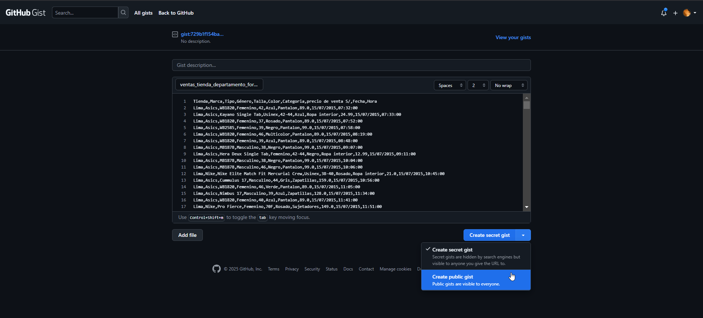

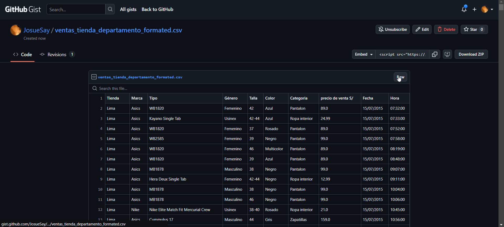

Enlace generado:

```markdown
https://gist.githubusercontent.com/JosueSay/7bbb5d5504463ce23056d468dd8077e4/raw/abdb23826c36770e3a9d5a4f4544cd53da32b990/ventas_tienda_departamento_formated.csv
```

Ambos métodos funcionan. En este caso, utilizaremos **Neo4j Console**, pero los queries también son compatibles con **Neo4j Browser**.

---

#### Uso de `LOAD CSV` en Neo4j

- **Función**: Importa datos desde archivos CSV a Neo4j.
- **Fuentes**:
  - Archivos locales: `file:///archivo.csv`
  - URLs remotas: `http://`, `https://`, `ftp://`
  - Servicios en la nube: `azb://` (Azure), `gs://` (Google Cloud), `s3://` (AWS S3)
- **Cláusulas clave**:
  - `LOAD CSV FROM 'url' AS row`: Carga el CSV fila por fila.
  - `WITH HEADERS`: Usa la primera fila como nombres de columnas.
  - `MERGE`: Crea o fusiona nodos/relaciones a partir de los datos.
  - `FIELDTERMINATOR ';'`: Define un delimitador personalizado.
- **Seguridad**:
  - Prefiere URLs con `HTTPS`.
  - Se recomienda configurar permisos en archivos locales.
- **Manejo de datos**:
  - Conversión de tipos (`toInteger()`, `date()`, `split()`).
  - Manejo de valores nulos (`coalesce()`, `nullIf()`).
  - Uso de listas (`split()`).
- **Optimización**:
  - Carga en transacciones (`CALL { ... } IN TRANSACTIONS`).
  - Creación de restricciones de unicidad antes de importar.
- **Compatibilidad**:
  - Soporta importación dinámica de etiquetas y CSV comprimidos (`.zip`, `.gzip`).

Para ver mas detalle de la instrucción LOAD CSV puedes revisar la documentación `detalle_load_csv.md`.

##### Importación con `LOAD CSV`

Dado que nuestro CSV tiene **800 registros y 10 variables**, **es adecuado para `LOAD CSV`**.

1. **Verificar CSV**

   - Antes de importar, verificamos la estructura del archivo:

     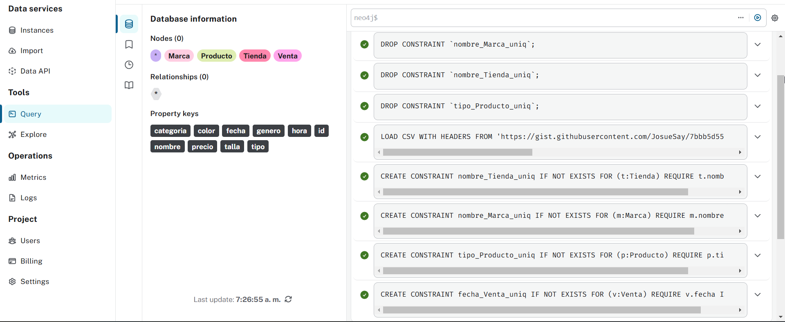

2. **Crear Nodos**

   - Ejecutamos la importación de nodos en **Neo4j Console**:

     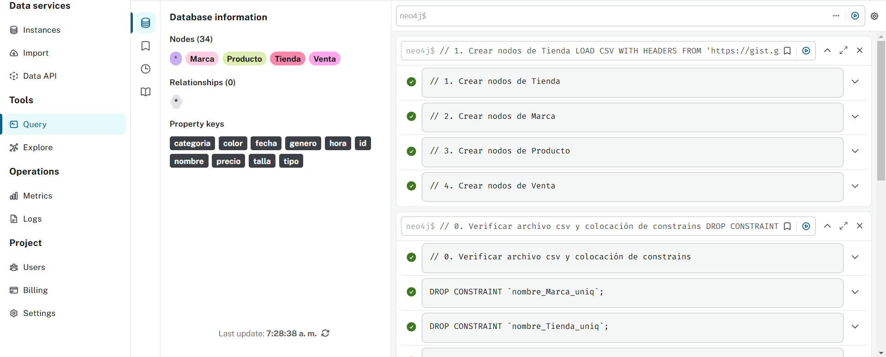

3. **Crear Relaciones**

   - Generamos las relaciones entre los nodos:

     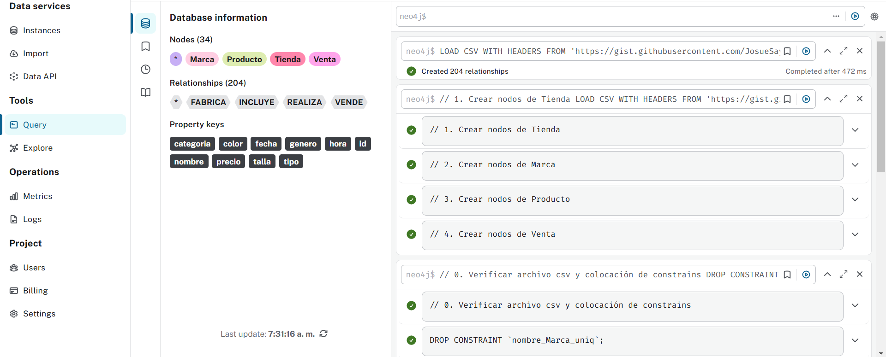

4. **Resultado Final**

   - El modelo final representado en forma de grafo:

     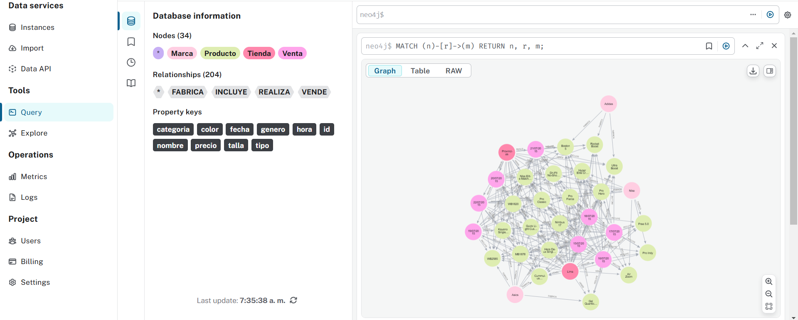

Los queries utilizados se encuentran en el archivo:

```markdown
code.cql
```

## 🔗 Enlaces Útiles

### Enlaces de Herramientas Utilizadas

- [Neo4j Console](https://console.neo4j.io/)
- [Neo4j Browser](https://browser.neo4j.io/)
- [Data Importer Neo4j](https://data-importer.neo4j.io/)
- [Arrows App Modelar Datos](https://arrows.app/#/local/id=50Jx0RywfReyZzq4_SXx)
- [Data Origen CSV](https://github.com/VictorGuevaraP/Mineria-de-datos/blob/master/Ventas%20tienda%20por%20departamento.csv)
- [Gist GitHub](https://gist.github.com/)

### Enlaces de Documentación

- [Neo4j](https://neo4j.com/)
- [Formas de Importar Archivos CSV](https://neo4j.com/docs/getting-started/data-import/csv-import/#optimizing-load-csv)
- [Documentación para la Importación de Datos en Neo4j por AuraDB](https://neo4j.com/docs/data-importer/current/)
- [Documentación para la Importación de Datos en Neo4j Por Cypher](https://neo4j.com/docs/cypher-manual/current/clauses/load-csv/)
- [Video Referencia 1](https://www.youtube.com/watch?v=Jro1MMzUAgs)
- [Video Referencia 2](https://www.youtube.com/watch?v=v-JdvAfRWtQ)
